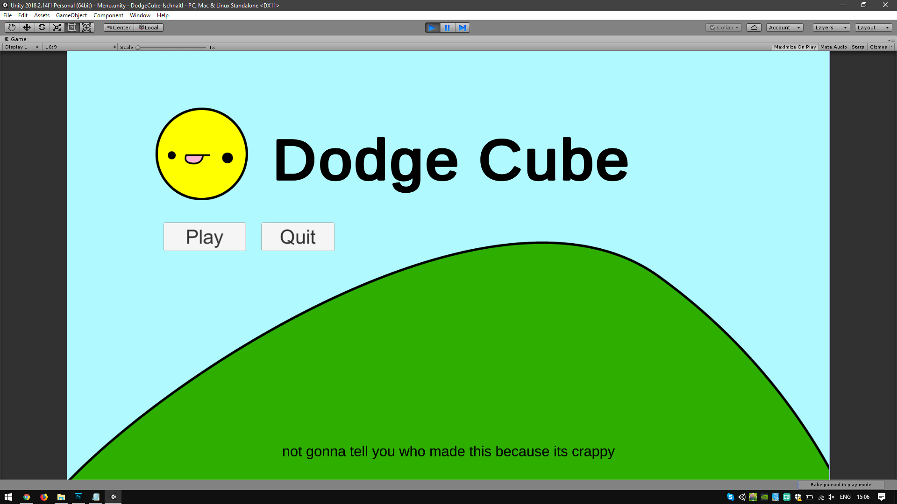
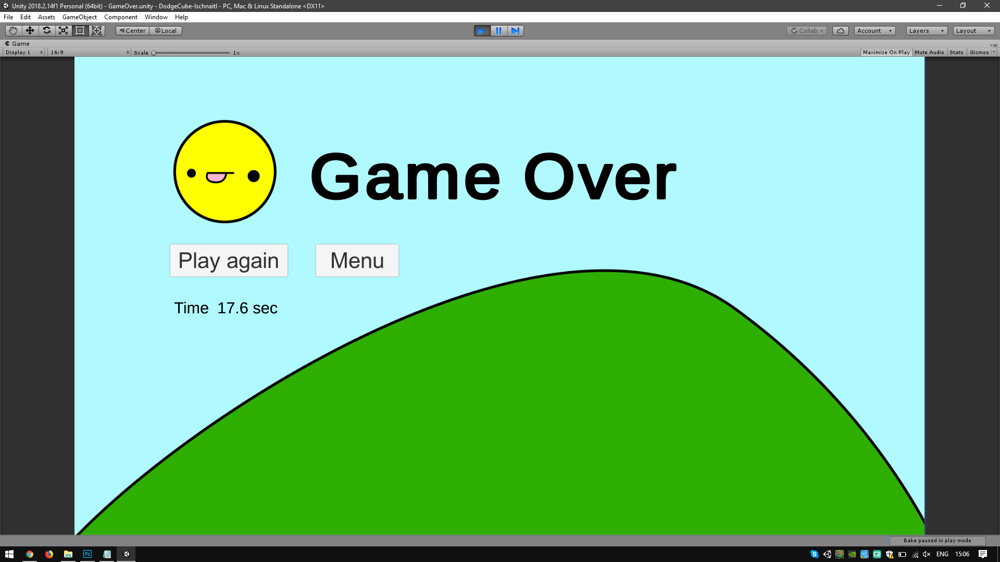
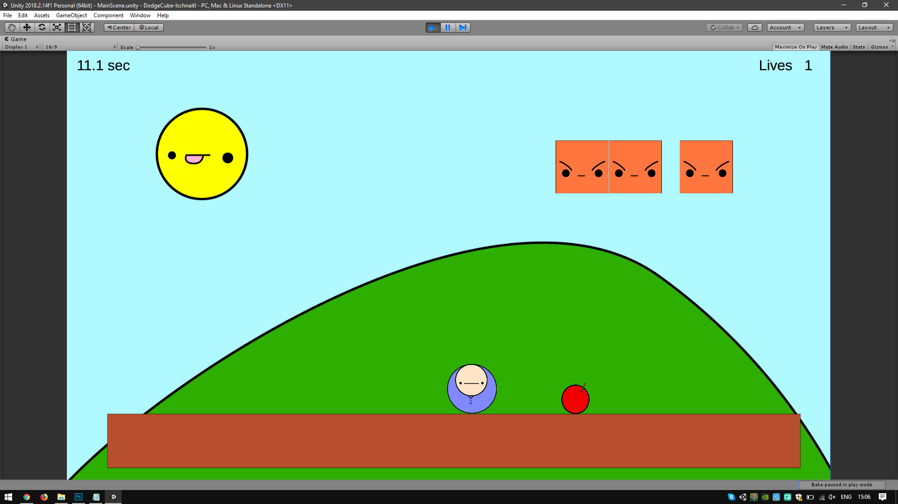

 + Name: 
	DodgeCube

 + Beschreibung: 
	Ein Player kann mit den Tasten A und D, Quadraten ausweichen die von oben auf ihn zukommen.

 + Development Platform: 
	Windows 10, Unity 2018.2.14f1, Visual Studio Community 2017 15.9, Scripting Runtime Version .NET 3.5, Api Compatibility Level .NET 2.0 Subset 

 + Target Platform: 
	PC Standalone

 + Used resources: none

 + Progress: 100%

 + Game Style: 2D

 + Status: 
	Implementation fertig, code Säuberung im gange

 + Steuerung: 
	Cursor (Maus) für Menü Elemente, Tastaturtasten A und D um den Spieler nach links und rechts zu bewegen.

<strong>Konzept:</strong>

<stong>Made by Leonhard Schnaitl</strong>